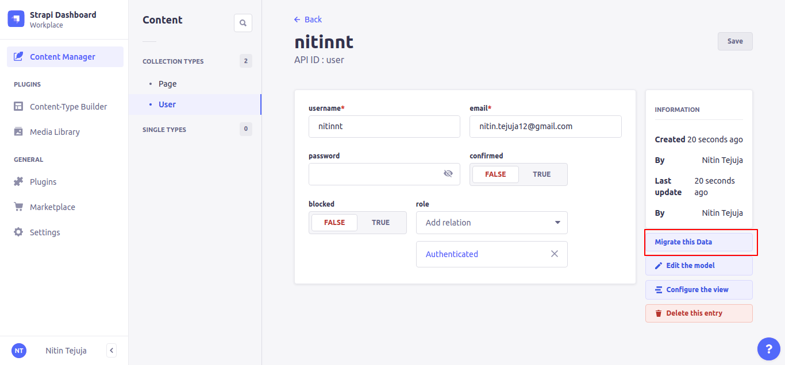
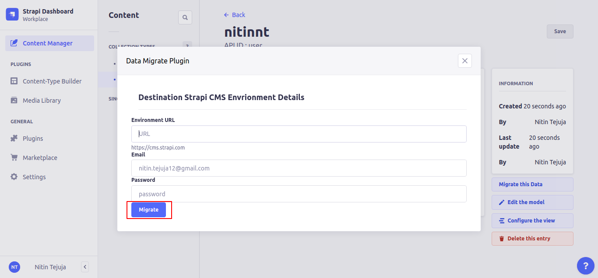

# Strapi Plugin Data Migrate

This plugin allows content manangers to migrate the contents from one Strapi CMS environment to other environment.

# How to install:

1.  In a root folder of your strapi project run `npm install @nitin.tejuja12/strapi-plugin-data-migrate --save`
2.  Rebuild admin UI `strapi build`
3.  Run `strapi develop`

# Configuration

`config/plugins.js`

```
module.exports = ({ env }) => ({
    'strapi-plugin-data-migrate': {
        enabled:true
    },
});
```


# How to use plugin:

1. Open Content manager section in Admin panel of Strapi CMS. 
2. Go to any Collection type and open any record and hit `Migrate this Data` button as shown in below image

3. Put your Destination Strapi CMS Envrionment Details and mention your credentials for destination environment.
4. Hit `Migrate` button to start the process of migrating the data from your current environment to destination environment.

